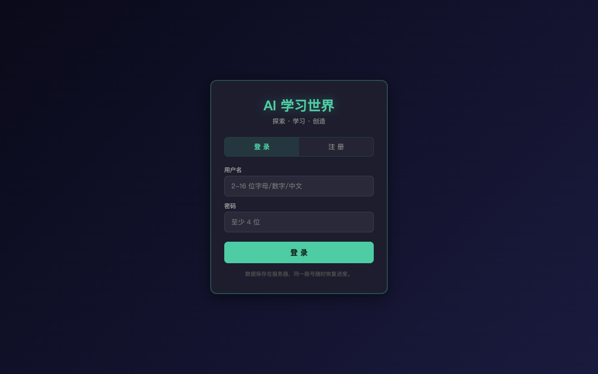
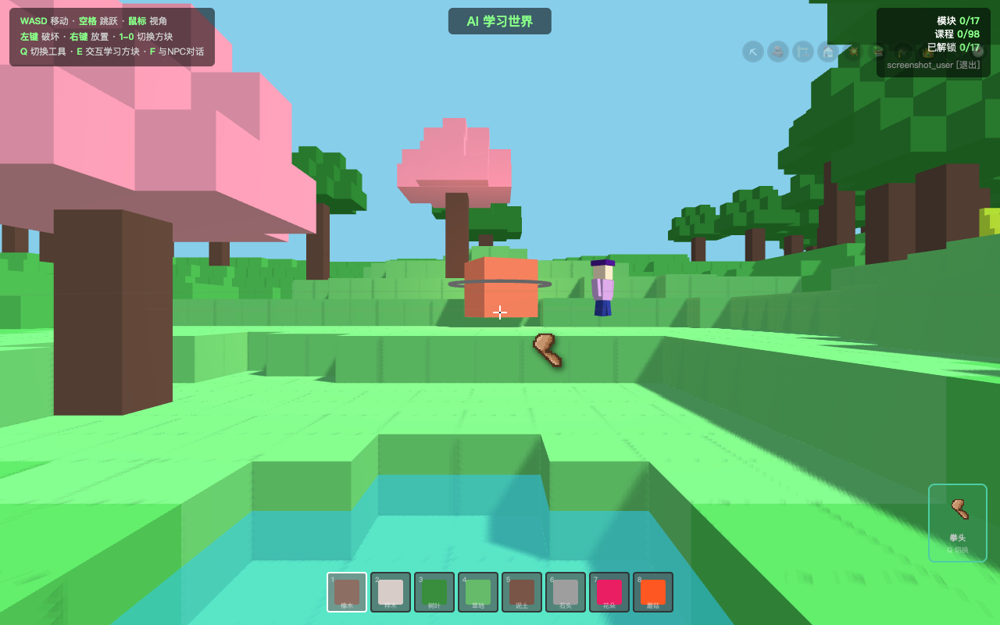
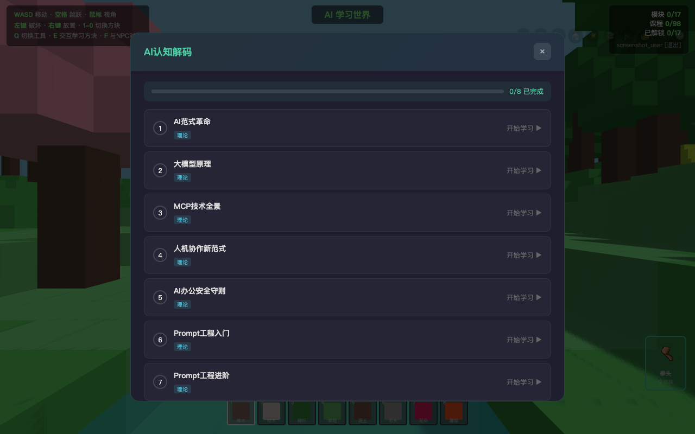
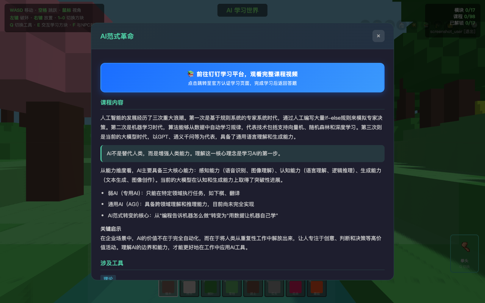
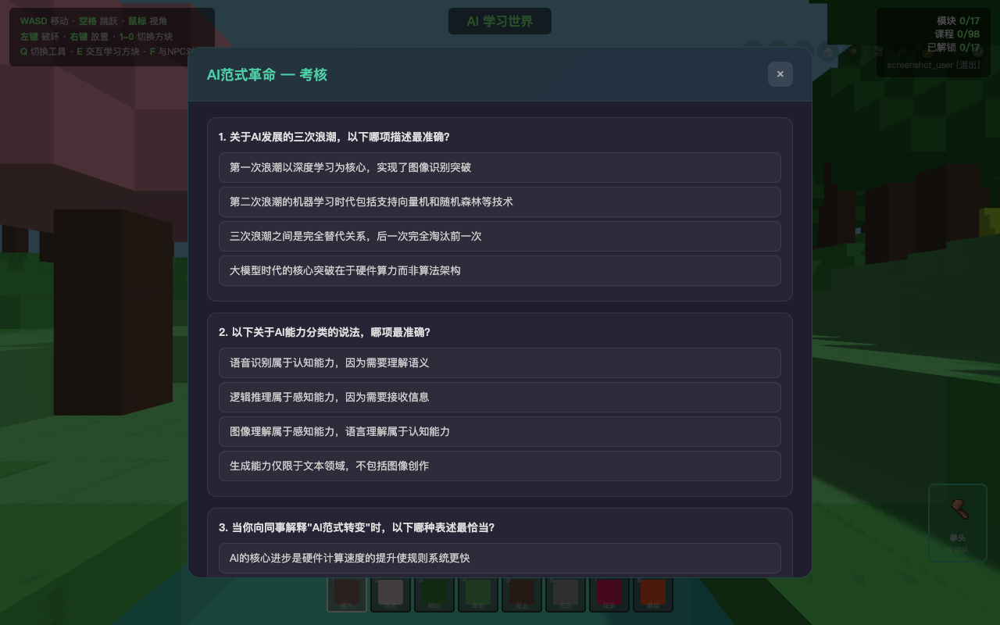

# AI 学习世界

> Minecraft 风格 3D 第一人称学习游戏，探索 · 学习 · 创造

一款基于 Three.js 构建的 3D 开放世界学习平台，将 AI 知识学习融入 Minecraft 风格的沙盒游戏中。玩家在 17 个主题区域中探索，与 NPC 对话，完成 98 门课程和 220+ 道考核题目，解锁区域后可自由建造。

## 游戏截图

### 登录界面


### 3D 开放世界


### 游戏 HUD（准星、工具、快捷栏）


### 学习模块列表


### 课程内容 & 钉钉学习平台入口


### 考核答题


## 特性

- **17 个主题区域** — 覆盖 AI 认知、智能办公、AI 写作、表格应用、智能体搭建、行业专题等
- **98 门课程** — 从初级到中级，内容涵盖大模型原理、Prompt 工程、钉钉 AI 工具、DEAP 平台等
- **220+ 道考核题** — 场景化题目，四个选项均具迷惑性，需真正理解才能通过
- **Minecraft 风格** — 方块世界、第一人称控制、建造/破坏系统
- **NPC 对话系统** — 走近触发对话，获取学习指引和区域介绍
- **成就系统** — 10 项成就，建造、破坏、学习、探索多维度
- **工具解锁** — 完成模块解锁镐子、斧头、锤子等工具
- **存档持久化** — 位置、视角、建造、进度、成就自动保存
- **钉钉学习平台链接** — 初级课程可跳转至官方认证学习页面

## 快速开始

### 环境要求

- Node.js >= 16
- npm

### 安装运行

```bash
# 克隆仓库
git clone https://github.com/GingerYang19/ai-learning-world.git
cd ai-learning-world

# 安装依赖
npm install

# 启动服务
npm start
```

浏览器访问 `http://localhost:3000`，注册账号即可进入游戏。

### Mac 桌面应用

```bash
# 安装 Electron 依赖
npm install

# 开发模式运行
npx electron .

# 构建 DMG 安装包
npx electron-builder --mac
```

构建产物在 `dist/` 目录下。

## 技术栈

| 层级 | 技术 |
|------|------|
| 3D 渲染 | Three.js r128 |
| 前端 | 原生 HTML/CSS/JS，单文件架构 |
| 后端 | Node.js + Express |
| 认证 | JWT (30天有效期，Cookie 存储) |
| 数据库 | xlsx 文件 (Excel 格式，零依赖部署) |
| 桌面端 | Electron |
| 像素图标 | Python + Pillow 程序化生成 |

## 项目结构

```
ai-learning-world/
├── server.js           # Express 服务端（路由、认证、API）
├── electron-main.js    # Electron 主进程
├── modules_data.js     # 课程模块数据（独立文件）
├── package.json
├── db/
│   └── index.js        # xlsx 数据适配层
├── public/
│   ├── game.html       # 游戏主页面（全部游戏逻辑）
│   ├── login.html      # 登录/注册页
│   └── img/            # Minecraft 风格像素工具图标
└── data/               # 运行时数据目录（自动创建）
    └── data.xlsx
```

## 游戏玩法

1. **注册登录** — 创建账号进入游戏世界
2. **探索区域** — 走近发光的检查点方块，点击打开学习模块
3. **学习课程** — 阅读课程内容，初级课程可跳转钉钉学习平台观看视频
4. **通过考核** — 全部答对解锁区域，该区域可自由建造
5. **解锁工具** — 完成更多模块解锁更强工具（镐子、斧头、锤子）
6. **与 NPC 互动** — 按 F 键与 NPC 对话，获取学习建议
7. **自由建造** — 在已解锁区域放置方块，包括发光块和玻璃块

## API 接口

| 方法 | 路径 | 说明 |
|------|------|------|
| POST | `/api/register` | 注册 |
| POST | `/api/login` | 登录 |
| POST | `/api/logout` | 登出 |
| GET | `/api/me` | 获取用户数据（含存档、进度、方块、成就） |
| POST | `/api/save` | 保存位置和视角 |
| POST | `/api/progress` | 保存课程进度 |
| POST | `/api/blocks` | 保存放置的方块 |
| POST | `/api/achievements` | 保存成就 |
| POST | `/api/stats` | 更新统计数据 |

## 许可证

MIT
